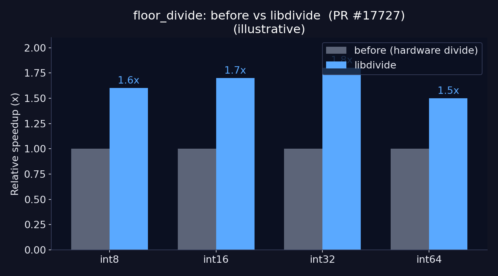
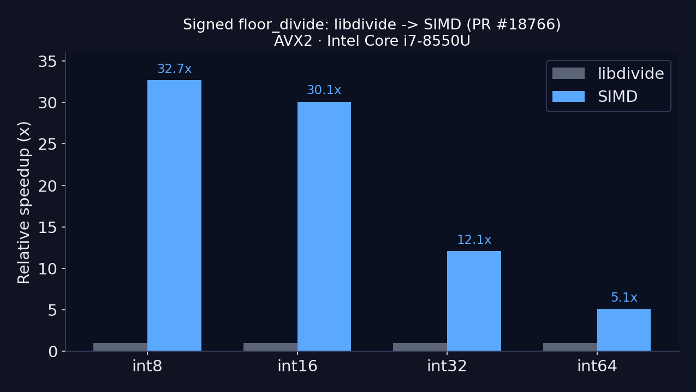

## Hi, I'm Ganesh {.smaller}

- Software engineer, open-source contributor to **NumPy** since 2020
- I contribute to the NumPy internals: **SIMD integer division**, new UFuncs
  (`bit_count`, `bitwise_count`), the **Meson** build migration, and the
  `spin` developer tooling to name a few.

::: {.notes}
Keep this short — 30 seconds. Land the hook: I work on the thing everyone
imports but nobody looks inside.
:::

## Under every ``import numpy`` {background-color="#0b1021"}

Pandas, PyTorch, scikit-learn, JAX, every dataframe and ML stack…

. . .

They all bottom out in **NumPy**.

. . .

So let's look at something completely ordinary:

```{pyodide}
import numpy as np
a = np.array([10, 20, 30, 40])
a // 3          # integer floor division on an array
```

. . .

What actually happens under this? It's weirder - and faster - than you'd think.

# Part 1 — Why is `a // b` slow? {background-color="#1a1a2e"}

## Division is the slow arithmetic {.smaller}

Rough latencies on a modern x86 core:

| Operation | Latency (cycles) |
|-----------|------------------:|
| add / sub | ~1 |
| multiply  | ~3 |
| **integer divide** | **~20–90** |

. . .

**Divide is the expensive one nobody thinks about** — and NumPy does it across
a whole array, millions of times.

::: {.notes}
Not all instructions cost the same. Numbers vary by microarchitecture; the point
is the order-of-magnitude gap between divide and everything else. And you never
divide once — the cost is multiplied across the array.
:::

## The key idea

> You can replace **division by a constant** with a **multiply and a shift**.

. . .

Dividing by 2? A compiler doesn't emit a `div`. It multiplies by a cleverly
chosen "magic number" and shifts — try it live:

```{pyodide}
import numpy as np
x = np.arange(10, dtype=np.uint64)   # Dividing 0 to 10 by 2
d, SHIFT = 2, 32                     # d is the divisor
magic = (1 << SHIFT) // d + 1        # precompute the "magic number" once

fast = (x * np.uint64(magic)) >> np.uint64(SHIFT)   # a multiply + a shift
slow = x // d                                       # a real hardware divide

fast, np.array_equal(fast, slow), magic   # same answer, no `div` instruction
```

. . .

The formal name: **"division by invariant integers using multiplication"**
(Granlund & Montgomery, 1994) — the trick behind **`libdivide`**.

::: {.notes}
Magic is computed ONCE, then reused for every element — that's the whole game.
The exact constant/shift depends on divisor + bit width; libdivide picks correct
ones for the full integer range (this demo is bounded).

Full refs:
- Granlund & Montgomery, "Division by Invariant Integers using Multiplication",
  PLDI 1994 — the foundational paper.
- Arch D. Robison, "N-Bit Unsigned Division via N-Bit Multiply-Add", 2005 —
  the unsigned round-up variant libdivide uses.
- Also covered in Warren, "Hacker's Delight", ch. 10.
:::

# Part 2 — The multiply-and-shift trick {background-color="#16213e"}

## Bringing libdivide into NumPy {.smaller}

Same divisor across the array → compute the magic number **once**, reuse it.

```c
struct libdivide_s64_t d = libdivide_s64_gen(divisor);   // once
for (i = 0; i < n; i++)
    out[i] = libdivide_s64_do(a[i], &d);                 // no hardware divide
```

**PR [#17727](https://github.com/numpy/numpy/pull/17727)** — libdivide in floor division. First real speedup.

. . .

But `//` must **floor** (toward −∞), not truncate like C (toward 0):

```{pyodide}
import numpy as np
np.array([-7]) // 2, -7 // 2, int(-7 / 2)   # -4, -4, -3
```

::: {.notes}
The divisor is often the same value repeated — that's what makes precompute-once
pay off. Floor-vs-truncate is exactly the kind of detail that bites you later —
foreshadow the bug. Run the cell live so the -4 vs -3 lands.
:::

## First speedup: before vs libdivide {.smaller}

::: {.r-stack}
{width="62%"}
:::

::: {.fragment}
No SIMD yet — just multiply-and-shift instead of a hardware divide. **~50%**
faster on integer `floor_divide` ([#17727](https://github.com/numpy/numpy/pull/17727)).
:::

::: {.notes}
~50% is the headline figure for #17727 (also what I cited at SciPy). The PR
posted a benchmark image, not a per-dtype table, so this is a single honest
number — not fabricated per-dtype bars. This is the *scalar* win; SIMD (next
slide) stacks on top with real per-dtype numbers.
:::

# Part 3 — Going SIMD, portably {background-color="#0f3460"}

## One divide at a time is still one at a time {.smaller}

libdivide removed the hardware `div`. But we still process **one element per
loop iteration**.

. . .

**SIMD** — Single Instruction, Multiple Data — does 4, 8, 16 elements *at once*:

```text
scalar:   [a0] / d  →  [a1] / d  →  [a2] / d  →  [a3] / d
SIMD:     [a0 a1 a2 a3] / d   →   all four, one instruction
```

. . .

But which instruction? AVX2? AVX-512? ARM NEON? They're all different.

## Universal intrinsics: write once, run fast everywhere {.smaller}

Write **one** loop against generic intrinsics → NumPy builds a version per
architecture and picks the best **at runtime**.

```c
npyv_s32 a = npyv_load_s32(src);
npyv_s32 q = npyv_divc_s32(a, divisor);   // vectorized divide-by-constant
npyv_store_s32(dst, q);
```

. . .

- **[#18075](https://github.com/numpy/numpy/pull/18075)** — **unsigned** floor division
- **[#18766](https://github.com/numpy/numpy/pull/18766)** — **signed** (the hard one: sign + floor, all vectorized)

::: {.notes}
NumPy has its own SIMD abstraction layer — one source, compiled specialized per
arch. Signed is hard because you handle sign and floor rounding in vectors.
:::

## Which instruction runs *here*? {.smaller}

NumPy tells you, **per ufunc + dtype**, what it built and what it picked:

```{pyodide}
import numpy as np
np.lib.introspect.opt_func_info(func_name="floor_divide", signature="l")
```

::: {.callout-note}
Live = WASM sandbox. On my Apple Silicon laptop it returns:
:::

```python
{'floor_divide': {'lll': {'available': 'baseline(NEON ... ASIMD)',
                          'current':   'baseline(NEON ... ASIMD)'}}}
# x86 would show 'AVX2 AVX512...' instead
```

::: {.notes}
opt_func_info is the money slide: it names the exact ufunc + type-code loop the
whole talk is about. Drop the signature filter to show every int dtype
(bbb, hhh, iii, lll, qqq + unsigned). If you can, run it from a REAL terminal on
the laptop live. Related: np.show_runtime() (my PR [#21468](https://github.com/numpy/numpy/pull/21468)) gives the CPU-level view.
:::

## The payoff {.smaller}

::: {.r-stack}
{width="66%"}
:::

::: {.fragment}
Narrower dtypes win most — more elements per SIMD register. **int8 ~33×**,
int64 ~5× on AVX2 ([#18766](https://github.com/numpy/numpy/pull/18766)).
:::

::: {.notes}
Real measured numbers from PR #18766 (before = libdivide, after = SIMD),
AVX2 on an Intel Core i7-8550U. Same PR also reports SSE4.1 (~2–25×), SSE3,
POWER9 VSX2, and AArch64 NEON (int8 ~10×, int64 ~1.1–1.3×) — smaller on the
weaker ARM core but still one codebase. Numbers are before/after averaged over
the 4 divisors reported per dtype.
:::

# Part 4 — The bug I shipped 😬 {background-color="#3a0ca3"}

## A ufunc is a *table*, tried in order {.smaller}

`floor_divide` is an **ordered list of typed loops** — NumPy runs the first one
your inputs fit into:

```{pyodide}
import numpy as np
np.floor_divide.types   # signed 'bb->b' must come before unsigned 'BB->B'
```

. . .

The rule: **signed before unsigned** for each width.

. . .

My SIMD change **([#18075](https://github.com/numpy/numpy/pull/18075))** emitted **unsigned first**.

::: {.notes}
NumPy scans the table top-to-bottom. Rule holds per width: bb->b before BB->B,
ll->l before LL->L, and so on.
:::

## Fast code that's wrong isn't fast {.smaller}

Signed data hitting an unsigned loop = same bits, read wrong → small negatives
become huge positives:

```{pyodide}
import numpy as np
np.array([-6], dtype=np.int8).view(np.uint8)   # -6 -> 250
```

. . .

`a // b` came back **silently wrong** — fast, vectorized, and incorrect.
Shipped to *millions*. 😬 Caught by **pandas**
([pandas#40874](https://github.com/pandas-dev/pandas/issues/40874)), not our tests.

## The fix, and closing the gap {.smaller}

**[#18751](https://github.com/numpy/numpy/pull/18751)** — a one-line reorder. The *real* fix: a **test**
asserting signed-before-unsigned for every ufunc.

. . .

Related edge case — `INT_MIN // -1` **overflows** (won't fit the type).
**[#21507](https://github.com/numpy/numpy/pull/21507) ·
[#21727](https://github.com/numpy/numpy/pull/21727)** warn instead of silent UB:

```python
>>> imin = np.iinfo(np.int64).min
>>> np.array([imin], dtype=np.int64) // np.int64(-1)
RuntimeWarning: overflow encountered in floor_divide
array([-9223372036854775808])        # wraps to INT_MIN, but you're warned
```

::: {.notes}
The reorder was in generate_umath.py. The .view() cell earlier showed the hazard
of signed->unsigned reinterpretation (illustrative, not the literal buggy output).
INT_MIN/-1: abs(INT_MIN) doesn't fit in the type — the classic overflow. Kept this
static because Pyodide's NumPy doesn't emit the RuntimeWarning; run it from a real
terminal live if you can.
:::

# Epilogue — six years later {background-color="#0b1021"}

## Full circle: the libdivide odyssey {.smaller}

- **2020** — libdivide arrives ([#17727](https://github.com/numpy/numpy/pull/17727))
- **2021** — `floor_divide` → SIMD ([#18075](https://github.com/numpy/numpy/pull/18075), [#18766](https://github.com/numpy/numpy/pull/18766)); `timedelta` left on libdivide
- **2026** — last path → SIMD: `timedelta` `floor_divide` **~5–6× faster** ([#32422](https://github.com/numpy/numpy/pull/32422))
- **2026** — libdivide **deleted**: −2,112 lines ([#32498](https://github.com/numpy/numpy/pull/32498))

. . .

{width="80%"}

. . .

Six years, start to finish. **That's open source.** 🥳

::: {.notes}
Years verified from merge dates: #17727 (2020), #18075 (2020) + #18766 (2021),
#32422 & #32498 (Sep 2026). Timedelta stayed on libdivide until 2026.
#32422 benchmark (real, measured on an M3 / NEON): timedelta floor_divide
ratios 0.16–0.21 → ~4.8–6.3× faster (author's headline: ~5–6×). Caveat: the
truncated `divide` path got ~1.1–1.4× SLOWER on that run, and AVX wasn't
benchmarked at PR time — so say "floor_divide, on M3" if pressed.
Punchline: I finished #32422 by feeding my own 3-year-old abandoned commit to
Claude. "libdivide odyssey" is the maintainer's own words — let it land.
:::

# Part 5 — What I'd want you to take away {background-color="#1a1a2e"}

## Takeaways {.smaller}

::: {.incremental}
1. **Division is expensive** — and multiply-and-shift is a beautiful way to
   dodge it
2. **SIMD portability is real** — universal intrinsics let one codebase go
   fast on Intel, AMD, and ARM
3. **Real OSS performance work** = benchmarks + review + mistakes + recovery,
   not just clever code
4. The code under your `import` is **approachable**. You can contribute to it.
:::

## Thank you! {background-color="#0b1021"}

- The PRs behind this talk:
  [#17727](https://github.com/numpy/numpy/pull/17727) ·
  [#18075](https://github.com/numpy/numpy/pull/18075) ·
  [#18766](https://github.com/numpy/numpy/pull/18766) ·
  [#18751](https://github.com/numpy/numpy/pull/18751) ·
  [#19135](https://github.com/numpy/numpy/pull/19135) ·
  [#21507](https://github.com/numpy/numpy/pull/21507) ·
  [#21727](https://github.com/numpy/numpy/pull/21727) ·
  [#32422](https://github.com/numpy/numpy/pull/32422) ·
  [#32498](https://github.com/numpy/numpy/pull/32498)
- GitHub: **[@ganesh-k13](https://github.com/ganesh-k13)**
- LinkedIn: **[ganesh-kathiresan](https://www.linkedin.com/in/ganesh-kathiresan/)**
- Questions?

::: {.notes}
Leave the PR numbers up during Q&A — people love to go read the actual diffs.
:::
